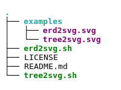
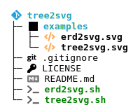

# tree2svg

A shell script that converts visual file trees to HTML. Not very sophisticated.

## Tree providers

You can choose to create a simple [`tree`](http://mama.indstate.edu/users/ice/tree/) or a more colorful one using [solidiquis/erdtree](https://github.com/solidiquis/erdtree).

Same Interface for `tree2svg.sh` and `erd2svg.sh`. Slightly different behaviour and output due to the different tree generators.

| `tree`                                   | `erd`                                                             |
|------------------------------------------|-------------------------------------------------------------------|
|                |                                          | 
| `/tree2svg.sh . > examples/tree2svg.svg` | `ADDITIONAL_ARGS='--no-git' ./erd2svg.sh >  examples/erd2svg.svg` | 

Note that the way the scripts handle the mapping of DevIcons used by erdtree is a bit crappy:  
It converts some common icons to SVG using twemoji and fontawesome (see [Mapping DevIcons](#mapping-devicons)).   
**Any ideas how to handle this more generically are welcome**.

## Usage

```shell
# Create a tree of the current folder and writes it stdout
./erd2svg.sh
# Create a tree of /some/dir and writes it to a file
./erd2svg.sh /some/dir > /some/other.svg
./erd2svg.sh /some/dir

# Additional params can be set via env

# If you want to edit the tree before it's converted
INTERACTIVE=true ./erd2svg.sh
# Use white line colors (e.g. for dark mode)
LINE_COLOR=white ./erd2svg.sh
# Pass additional args to tree provider
ADDITIONAL_ARGS='--no-git' ./erd2svg.sh
# Change root icon (to git for example)
ROOT_ICON='<i class="fab fa-git-alt fa-lg">'

# Multiple params
INTERACTIVE=true ADDITIONAL_ARGS='--no-git --dirs-only' ./erd2svg.sh
```

## Requirements
* Tree provider for creating the tree "text"
  * `tree` (for `tree2svg.sh`, tested with tree v2.1.0) or
  * [`erdtree`](https://github.com/solidiquis/erdtree) (for `erd2svg.sh`, tested with version 3.1.2) 
* [`aha`](https://command-not-found.com/aha) (ANSI/HTML Adapter) for converting to HTML,
* `docker` and [`fathyb/html2svg`](https://github.com/fathyb/html2svg) image for converting to SVG,
* [`vipe`](https://command-not-found.com/vipe), when using `INTERACTIVE`

## Post-processing

For now the result is in an SVG with a canvas that's too large.  
You can fix that manually by adopting `width` and `height` empirically: Too small will crop parts of the SVG.

If you need to convert to PDF, importing into draw.io and adopting the paper size (e.g. with "Custom") and the export PDF worked for me.

## Credit

This is based on graphics I created for a talk on GitOps:
* [Original "script"](https://github.com/cloudogu/gitops-talks/blob/97053fc22af40525c5f62501cb17a6db04169585/docs/image-sources/repo-examples/creating-structure-svgs.md) containing some more info on how to use the trees interactively in reveal.js
* [Some more complex trees](https://cloudogu.github.io/gitops-talks/2023-03-mastering-gitops/#/ex2/8) 

## Mapping DevIcons

Some hints for finding a matching FontAwesome or emoji to nerdfonts/devicons

* https://fontawesome.com/v5/icons/
* https://www.nerdfonts.com/cheat-sheet
* https://emojipedia.org/ or your local emoji-picker
